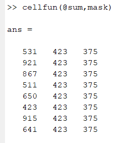

The GUI will make one for each environment. Within each folder, there will be a folder named “Functional” and within “Functional” you will have:

- frame_removal_mask.mat, a file with the mask that contains the frames included/excluded on each participant and 
- a folder per parcellation schema containing:
    - connectivity matrices 
    - raw timecourses


```
+--- output_GUI_env
|   +--- standard
|   |   +--- Functional
|   |   |   +--- list_MCMethod_power_2014_FD_only_FD_th_0_10_min_frames_375_skip_frames_5_TRseconds_0_80
|   |   |   |   +--- frame_removal_mask.mat
|   |   |   |   +--- Gordon2014FreeSurferSubcortical_timeseries.ptseries
|   |   |   |   |   +--- fconn_375_frames.mat
|   |   |   |   |   +--- fconn_423_frames.mat
|   |   |   |   |   +--- fconn_all_surv_frames.mat
|   |   |   |   |   +--- raw_timecourses.mat
|   |   |   |   +--- HCP2016FreeSurferSubcortical_timeseries.ptseries
|   |   |   |   |   +--- fconn_375_frames.mat
|   |   |   |   |   +--- fconn_423_frames.mat
|   |   |   |   |   +--- fconn_all_surv_frames.mat
|   |   |   |   |   +--- raw_timecourses.mat
```

The saved data will allow you to validate the calculation of connectivity matrices. 

The file frame_removal_mask.mat contains a cell named mask. The size of the cell is # of surviving participants times 3. 



Each row correspond to the surviving participant and each column corresponds to the 3 masks of surviving frames to calculate connectivity matrices per participant (see [Step 6](usage.md) for the explanation of the way the frames are selected for each one of the 3 connectivity matrices).
