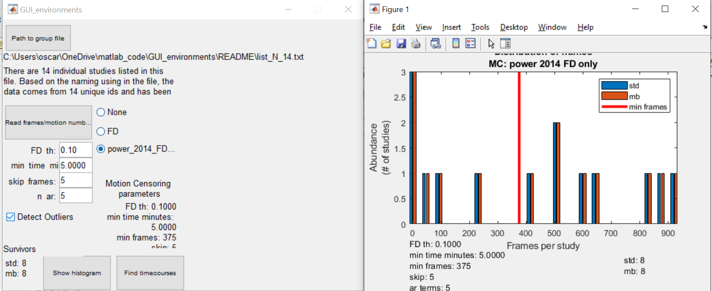

To run it, you need an iterative Matlab session and also to have access to the 
processed data. You can also run the executable (WIP)

# Step 1

After opening Matlab, add to your current session the path to the code. For example, if the code lives in `C:\Users\oscar\OneDrive\matlab_code`, 
you need to type in Matlab:

```matlab
addpath(genpath('C:\Users\oscar\OneDrive\matlab_code'))
```

Alternatively, run the executable (WIP).

# Step 2

Next, open the GUI_environments by simply typing in your Matlab terminal “GUI_environments”:

```matlab
>> GUI_environments
```

If this is the first time you are running the *GUI_environments* on your system, it will ask for the path to *wb_command*:


# Step 3

The GUI will open and ask for the path to the txt file that contains the list of participants:


After clicking on “Path to group file”, provide the path to the txt file:


After selecting the file, click on “Open”. The GUI will read the paths and will determine how many different versions of the pipeline were used when processing data since this parameter is encoded in the Folder name of the processed data. The GUI will display the number of participants and the number of versions of the pipeline used to process the data.


# Step 4

Click on “Read frames and motion numbers”. The GUI will read the parcellated timecourses and the corresponding motion numbers. 

When done, the GUI will ask for alternative path for *variance files*:

    'Some variance files might not exist in the derivatives folder. If existing, provide an alternative path to look for variance files'

If you [premade variance files using `dtvariance_patch`](prep_variance.md), you can provide the path to that folder as shwon in this figure:


Next it will ask for the method to use for motion censoring. Default is power 2014 fd only. Then, the GUI will ask for other parameters for inclusion and exclusion of frames:


* **FD_th** (frame displacement threshold): maximum FD allowed to be included. Frames with a FD higher than the number provided here will be excluded. Default is 0.2. Note, the GUI will also discharge segments of less than 3 continuous surviving frames flanked by “bad” frames (ie frames with FD larger than the threshold).
* **min_time_minute**: how long (in minutes) the surviving frames need to add to for inclusion. Participants with a total number of surviving frames less than the time selected here will be excluded. Default is 2.5 minutes.
* **kip_frames**: How many frames to exclude at the beginning of each resting state session. Default is 5.
* **n_ar**: How many autoregressive terms to use to remove autocorrelations. You can leave it at 5 (the default value).
* **Detect Outliers**: 1 or 0, ie yes or not, respectively. It selects outliers based on the variance across grayordinates (ie the variance was calculated on each dtseries file before parcellation) on the surviving frames. It uses the Matlab’s function "*isthisanoutlier*” using the method: 'median'. 


The GUI also calculates and displays “on the fly” the number of surviving participants as you change the options


# Step 5

The dialog “Show histogram” will help you to decide values for the parameters to use to maximize the number of participants. For example, if the default values are used, 4 participants survive motion censoring.

