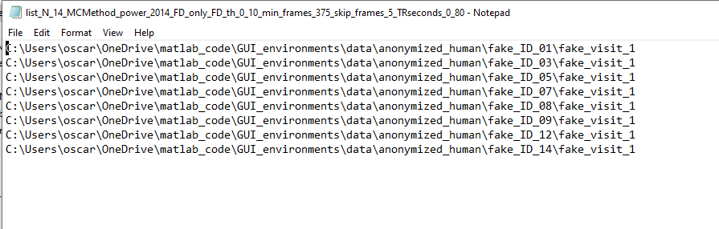

To run it, you need an iterative Matlab session and also to have access to the 
processed data. You can also run the executable (WIP)

# Step 1

After opening Matlab, add to your current session the path to the code. For example, if the code lives in `C:\Users\oscar\OneDrive\matlab_code`, 
you need to type in Matlab:

```matlab
addpath(genpath('C:\Users\oscar\OneDrive\matlab_code'))
```

Alternatively, run the executable (WIP).

# Step 2

Next, open the GUI_environments by simply typing in your Matlab terminal “GUI_environments”:

```matlab
>> GUI_environments
```

If this is the first time you are running the *GUI_environments* on your system, it will ask for the path to *wb_command*:


# Step 3

The GUI will open and ask for the path to the txt file that contains the list of participants:


After clicking on “Path to group file”, provide the path to the txt file:


After selecting the file, click on “Open”. The GUI will read the paths and will determine how many different versions of the pipeline were used when processing data since this parameter is encoded in the Folder name of the processed data. The GUI will display the number of participants and the number of versions of the pipeline used to process the data.


# Step 4

Click on “Read frames and motion numbers”. The GUI will read the parcellated timecourses and the corresponding motion numbers. 

When done, the GUI will ask for alternative path for *variance files*:

    'Some variance files might not exist in the derivatives folder. If existing, provide an alternative path to look for variance files'

If you [premade variance files using `dtvariance_patch`](prep_variance.md), you can provide the path to that folder as shwon in this figure:


Next, it will ask for the method to use for motion censoring. Default is power 2014 fd only. Then, the GUI will ask for other parameters for inclusion and exclusion of frames:


* **FD_th** (frame displacement threshold): maximum FD allowed to be included. Frames with a FD higher than the number provided here will be excluded. Default is 0.2. Note, the GUI will also discharge segments of less than 3 continuous surviving frames flanked by “bad” frames (ie frames with FD larger than the threshold).
* **min_time_minute**: how long (in minutes) the surviving frames need to add to for inclusion. Participants with a total number of surviving frames less than the time selected here will be excluded. Default is 2.5 minutes.
* **kip_frames**: How many frames to exclude at the beginning of each resting state session. Default is 5.
* **n_ar**: How many autoregressive terms to use to remove autocorrelations. You can leave it at 5 (the default value).
* **Detect Outliers**: 1 or 0, ie yes or not, respectively. It selects outliers based on the variance across grayordinates (ie the variance was calculated on each dtseries file before parcellation) on the surviving frames. It uses the Matlab’s function "*isthisanoutlier*” using the method: 'median'. 


The GUI also calculates and displays “on the fly” the number of surviving participants as you change the options


# Step 5

The dialog “Show histogram” will help you to decide values for the parameters to use to maximize the number of participants. 

Every time you change the parameters, you can recalculate the histogram of surviving frames and participants:


# Step 6

Once happy with the motion censoring parameters, click on "Find timecourses" for the Next step: Read frames and motion numbers


It is extremely important to understand that the GUI will calculate 3 connectivity matrices per participant. Those connectivity matrices are calculated using different number of frames. 
In the example used here, we said that we want connectivity matrices with at least 5 minutes of data, ie using 375 frames with a TR of 0.8 seconds (5x60/0.8=375), (Note: the GUI reads the TR within the provided data, so no need to provide this number). 
While each surviving participant will have at least 375 frames, each participant can have a distinct number of “good frames” (>375). 
For example, surviving participant 1 has 163 “good (low motion)” frames and surviving participant 2 has 166 frames. The minimum number of good frames across participants is 163. Hence, the GUI will calculate 3 connectivity matrices per participant:

* Using exactly the number of frames specified in the min_time_minute dialog. Frames are selected randomly out of all the surviving frames. In this example, each surviving participant will have connectivity matrices with 150 good frames.
* Using the minimum number of good frames above “min_time_minute”. Frames are selected randomly from the surviving frames. In this case, each participant will have a connectivity matrix with 163 frames selected. For participant 1 this connectivity matrix will have all the surviving frames. For the participant 2, 163 frames will be selected randomly out of the 166 surviving frames.
* Using all the frames. A connectivity matrix per participant using all the surviving frames.

You might want to maximize the number of surviving frames to be included by adjusting the  parameter “min_time_minute”. This procedure might be relevant if you want to calculate connectivity matrices and save the data per group on different folders. Your groups of interest could be “Controls”, “Condition x”, “Intervention y”. To do this, you need to run the GUI environments on each list, so you might want to use the same (optimized) “min_time_minute” each time you run the GUI.

# Step 7

You'll be asked whether you want the GUI to read timecourses and validate framecount before doing connectivity matrices. 

If you believe the number of frames across parcellation schemas within subjects are right, say "No" to save time. 


# Step 8

If there are no problems (missing files tipically), the GUI will find all the parcellated timecourses and will let you know how many parcellation schemas you have. 

It is the time to select which parcellation schemas and environments you want to include for connectivity matrices


# Step 9

Now, click on “Set path output” to indicate the folder you like the data to be saved in and click “Open”:


# Step 10

Once selecting the output folder, you just need to click on “Make environments”


The GUI will make a new txt file that only includes the surviving participants. The order of the participants in this new file is preserved in the concatenate timecourses and connectivity matrices created with this GUI. 

The filename of the surviving participants will have as prefix the filename of the original list. After that prefix, the new name will have encoded the parameters used for motion censoring:


