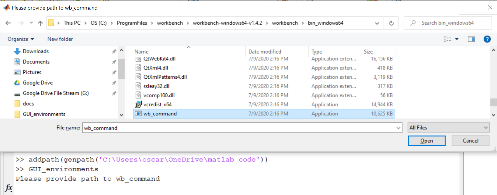

To run it, you need an iterative Matlab session and also to have access to the 
processed data. You can also run the executable (WIP)

# Step 1

After opening Matlab, add to your current session the path to the code. For example, if the code lives in `C:\Users\oscar\OneDrive\matlab_code`, 
you need to type in Matlab:

```matlab
addpath(genpath('C:\Users\oscar\OneDrive\matlab_code'))
```

Alternatively, run the executable (WIP).

# Step 2

Next, open the GUI_environments by simply typing in your Matlab terminal “GUI_environments”:

```matlab
>> GUI_environments
```

If this is the first time you are running the *GUI_environments* on your system, it will ask for the path to *wb_command*:



# Step 3

The GUI will open and ask for the path to the txt file that contains the list of participants:


After clicking on “Path to group file”, provide the path to the txt file:


After selecting the file, click on “Open”. The GUI will read the paths and will determine how many different versions of the pipeline were used when processing data since this parameter is encoded in the Folder name of the processed data. The GUI will display the number of participants and the number of versions of the pipeline used to process the data.

